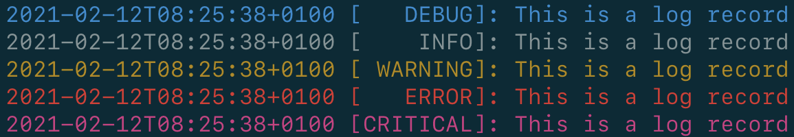
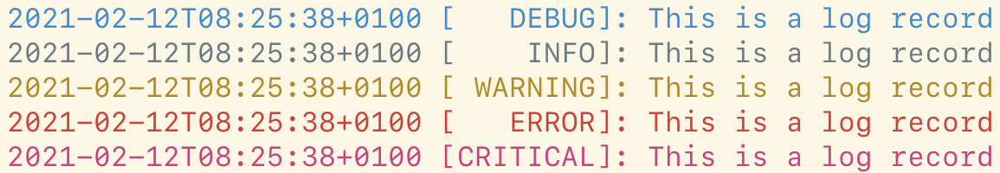

# Coding Guidelines

## Comments

- Use docstrings for commenting modules, functions, classes, and method definitions according to the [numpydoc docstring guide](https://numpydoc.readthedocs.io/en/latest/format.html).

- Add a newline after a docstring.

- Do <u>not</u> use docstrings for other comments.

  Example (correct):

  ```python
  # This …
  while(...)
  ```

  Example (wrong):

  ```python
  """This …"""
  while(...)
  ```

- Start comments with lowercase if they are not complete sentences.

## Copyright headers

Each source code file must have the following copyright header (`$COMMIT_YEAR_RANGE` must be matched by the regular expression `(\d\d\d\d)(, (\d\d\d\d))*` and specify the years of creation and last modification according to Git):

```python
#  Copyright $COMMIT_YEAR_RANGE IBM Corporation
#
#  Licensed under the Apache License, Version 2.0 (the "License");
#  you may not use this file except in compliance with the License.
#  You may obtain a copy of the License at
#
#  http://www.apache.org/licenses/LICENSE-2.0
#
#  Unless required by applicable law or agreed to in writing, software
#  distributed under the License is distributed on an "AS IS" BASIS,
#  WITHOUT WARRANTIES OR CONDITIONS OF ANY KIND, either express or implied.
#  See the License for the specific language governing permissions and
#  limitations under the License.
```

There is a script to automatically correct copyright headers ([Development Guide](development_guide.md)).

## Errors

- When raising an Exception, use the `CloudPakOperationsCLIException` class or `IBMCloudExceptionClass` class.
- Error messages must be complete sentences with a full stop or incomplete sentences without a full stop.

## Imports

To avoid circular imports, a module contained in one of the packages shown in the table below is only allowed to import other modules of the following categories:

- modules from the same package or other packages in the same row if no circular import is created
- modules from other packages in rows below the row containing the package of the module

| 1st level packages | 2nd level packages | 3rd level packages                                |
| ------------------ | ------------------ | ------------------------------------------------- |
| test               | …                  |                                                   |
| cpo                | cpo.commands       | cpo.commands.adm<br />cpo.commands.cluster<br />… |
|                    | cpo.lib            | cpo.lib.click<br />…                              |
|                    | cpo.config         |                                                   |
|                    | cpo.utils          |                                                   |

For example, a module contained in the `cpo.config` package is allowed to import modules from the `cpo.utils` package but must not import modules from the `cpo.lib` package.

## Line length

- Code: 120
- Comments (excluding indentation, including quotation marks): 72
- [Black (formatter) configuration](https://github.com/IBM/cloud-pak-operations-cli/blob/master/.vscode/settings.json) ("python.formatting.blackArgs")
- [Flake8 (linter) configuration](https://github.com/IBM/cloud-pak-operations-cli/blob/master/setup.cfg)

## Logging

### Methods to display output on the console

There are two methods to display output on the console:

- using `click.echo()` [`print()` [should not be used](https://click.palletsprojects.com/en/7.x/utils/#printing-to-stdout)]
- using the `logging` package

The root logger of the `logging` package is configured to prefix each message of a log record with the current timestamp and the log level of the log record using colored output:





Use the following decision criteria when to use which method:

- Use `click.echo()` when printing the current timestamp and the log level is not appropriate. For example, when …

  - … printing output that may be consumed by other programs (example: `cpo cluster current`).
  - … printing output that is formatted (example: `cpo cluster ls`).
  - … printing output that is important for subsequent user interaction.

- Use the `logging` package when printing the current timestamp and the log level is appropriate:

  - Use `logging.debug()` to print debug messages.
  - Use `logging.info()` to print informational messages, which are shown by default when using the `@loglevel_command` decorator. For example, when printing information about a subsequently executed longer-running command.
  - Use `logging.warning()` to print warnings.

  Instead of using `logging.error()` or `logging.critical()`, raising an exception is probably more appropriate in most cases.

### Click support

The advantage of the `logging` package is that the log level of the current logger may be changed to suppress log messages. To expose this feature when executing CLI commands, Click commands should be defined using the `@loglevel_command` decorator, which automatically appends a non-required option named `--loglevel`:

```
Options:
…
  --loglevel [DEBUG|INFO|WARNING|ERROR|CRITICAL]
                                  Log level
  --help                          Show this message and exit.
```

The default log level set by this option is `INFO`.

The `logging` package and the decorator may be used as follows:

```python
import logging

from cpo.utils.logging import loglevel_command

logger = logging.getLogger(__name__)


@loglevel_command()
def command():
    logger.info("…")
```

In some cases, it makes sense to set the default log level to `WARNING`. For example, when a command displays output that may be consumed by other programs, but it invokes code that uses the `logging` package and displays undesired log messages. In this case, the default log level may be passed to the decorator:

```python
@loglevel_command("WARNING")
```

#### Colored Output

When using the `logging` package, output may be styled as follows:

```python
logging.info(click.style("", ...))
```

As white output is invisible when using a shell theme with a light background, `fg="bright_white"` or `fg="white"` should not be used.

## Logic

- Suggestion (not mandatory): Use explicit comparison of truthy/falsy values.

  Example (explicit comparison):

  ```python
  if result is not None:
      ...
  if result is None:
      ...
  ```

  Example (implicit comparison):

  ```python
  if result:
      ...
  if not result:
      ...
  ```

## Naming

- When calling external programs, use long command line option names.

  Example (correct):

  ```shell
  cpd-cli --namespace $NAMESPACE
  ```

  Example (wrong):

  ```shell
  cpd-cli -n $NAMESPACE
  ```

## Order

### Class variables/methods

- Mark "private" class variables and methods with a proceeding underscore (see [official documentation](https://docs.python.org/3/tutorial/classes.html#private-variables)).

- Suggestion (not mandatory): Sort members and methods (inside or outside classes) in the following order:

  - "public" class variables
  - "public" class/static methods
  - "public" methods
  - "private" class variables
  - "private" class/static methods
  - "private" methods

  Example:

  ```python
  class Example:
      public_class_variable = ...

      @classmethod
      def public_class_method(cls): ...

      @staticmethod
      def public_static_method(): ...

      def public_method1(): ...
      def public_method2(): ...
      def public_method3(): ...

      _private_class_variable = ...

      @classmethod
      def _private_class_method(cls): ...

      @staticmethod
      def _private_static_method(): ...

      def _private_method1(): ...
      def _private_method2(): ...
      def _private_method3(): ...
  ```

### Command line options

- Sort command line options when calling external programs.

### Imports

- Sort imports using [isort](https://pycqa.github.io/isort/) (Visual Studio Code: Commands \| Python Refactor: Sort Imports)
- [isort configuration](https://github.com/IBM/cloud-pak-operations-cli/blob/master/.vscode/settings.json) ("python.sortImports.args")

## Vertical space

- Add newline after end of scope.

  Example (correct):

  ```python
  if (...):
      print(...)

  while (...)
  ```

  Example (wrong):

  ```python
  if (...):
      print(...)
  while (...)
  ```
